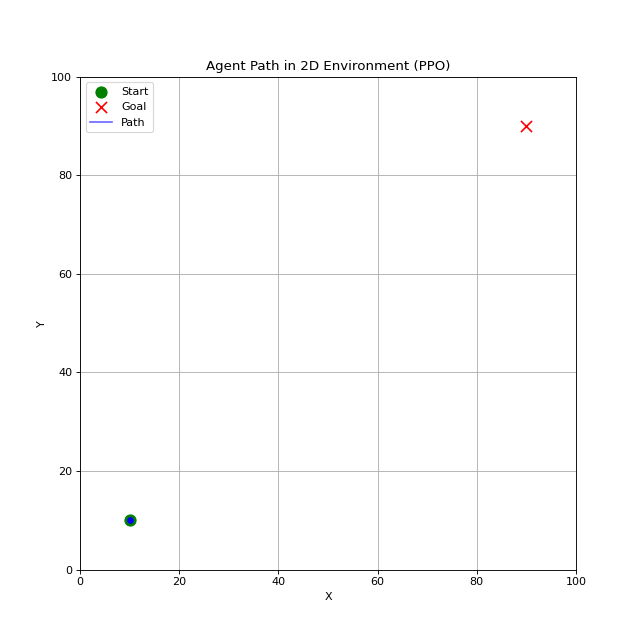

# Multi-Agent Path Planning

Deep Reinforcement Learning으로 UAV path planning을 실험하는 저장소입니다.

처음에는 single-agent DRL부터 잡고, 그 위에 multi-agent DRL까지 확장하는 방향으로 진행했습니다. 최근 정리는 다시 single-agent 쪽에 초점을 맞췄고, MADRL 코드는 아직 실험 흔적과 체크포인트는 남아 있지만 현재 코드 기준으로는 정리 대상에서 빠져 있습니다. 이 README도 `legacy/` 폴더는 제외하고, 지금 레포에 살아 있는 코드 기준으로 작성했습니다.

## 현재 상태

### Single-Agent DRL

| Algorithm | Status | Notes |
| --- | --- | --- |
| DQN | Done | 2D discrete 환경 기준 구현 및 체크포인트 있음 |
| PPO | Done | 2D continuous 환경 기준으로 최근 정리됨. discrete/continuous actor-critic 구조 지원 |
| DDPG | WIP | agent 구현과 체크포인트는 있으나 패키지 export에는 아직 포함되지 않음 |
| A3C | Backlog | 아직 구현 없음 |
| SAC | Backlog | 아직 구현 없음 |

### Multi-Agent DRL

| Algorithm | Status | Notes |
| --- | --- | --- |
| MAPPO | Archived/WIP | 예전 실험 결과와 GIF는 남아 있으나 현재 `mappo.py`는 비어 있음 |
| MADDPG | Archived/WIP | 파일만 남아 있고 현재 구현은 비어 있음 |
| QMIX | Archived/WIP | 파일만 남아 있고 현재 구현은 비어 있음 |
| IQL / VDN / COMA | Backlog | 현재 정리된 구현 없음 |

### Environments

| Environment | Status | Notes |
| --- | --- | --- |
| 2D Single UAV | Active | `discrete`, `continuous` action space 지원 |
| 2D Multi UAV | Active/WIP | 여러 UAV의 시작점, 목표점, 장애물, agent-agent collision 처리 포함 |
| 3D Single / Multi UAV | Placeholder | 파일은 있으나 현재 구현은 비어 있음 |

## Repository Layout

```text
src/
  envs/
    env_2d_single.py    # 2D single-agent UAV environment
    env_2d_multi.py     # 2D multi-agent UAV environment
    env_3d_single.py    # placeholder
    env_3d_multi.py     # placeholder
  drl/
    algorithm/
      dqn.py            # DQN agent + simple training loop
      ppo.py            # PPO agent + simple training loop
      ddpg.py           # DDPG agent + simple training loop
      mappo.py          # placeholder
      maddpg.py         # placeholder
      qmix.py           # placeholder
    network/
      qnet.py           # DQN Q-network
      a2c_ppo.py        # PPO actor-critic network
      a2c_ddpg.py       # DDPG actor/critic networks
  utils/
    buffer.py           # replay / rollout buffers

db/
  checkpoints/          # recently generated checkpoints
  saves/                # older saved models and experiment outputs

docs/
  *.gif                 # rendered 2D experiment results
```

## Setup

```bash
pip install -r requirements.txt
```

PyTorch는 현재 CUDA 13.0 빌드가 requirements에 고정되어 있습니다. CPU 환경이나 다른 CUDA 버전을 쓰는 경우에는 PyTorch 설치 명령을 환경에 맞게 바꾸는 편이 안전합니다.

## Running Experiments

현재는 별도의 통합 CLI보다 각 알고리즘 파일 안의 `__main__` 블록을 통해 바로 실험하는 구조입니다.

```bash
python -m src.drl.algorithm.dqn
python -m src.drl.algorithm.ppo
python -m src.drl.algorithm.ddpg
```

렌더링은 `render.py`에 2D PPO 체크포인트를 불러오는 예제가 들어 있습니다.

```bash
python render.py
```

다만 `render.py`에는 개인 유틸인 `kkh_utils.apply_research_style()` 호출이 남아 있습니다. 다른 환경에서 바로 실행하려면 해당 import를 제거하거나 같은 기능의 스타일 설정 코드로 바꿔야 합니다.

## Simulation Results

### DQN - 2D Discrete

- Model: `db/saves/dqn/2d/20251223_141101/final.pth`
- Episodes: 1000
- Max steps: 200


### PPO - 2D Continuous

- Model: `db/saves/ppo/2d/ppo_agent_best.pth`
- Episodes: 1000
- Max steps: 500



### DDPG - 2D Continuous

- Model: `db/saves/ddpg/2d/ddpg_final.pth`
- Episodes: 1000
- Max steps: 200


### MAPPO - 2D Multi-Agent

- Model: `db/saves/mappo/2d/mappo_actor_500steps.pth`
- Episodes: 1000
- Max steps: 500
- Note: 현재 코드 기준으로 MAPPO 구현 파일은 비어 있으므로, 아래 결과는 이전 실험 산출물로 보는 것이 맞습니다.


## Next Cleanup

- `DDPGAgent`를 `src/drl/algorithm/__init__.py`에 export할지 결정하기
- `render.py`에서 개인 유틸 의존성 제거
- training / evaluation entrypoint를 공통 CLI로 다시 묶기
- 3D 환경을 구현할지, placeholder 파일을 제거할지 결정하기
- MADRL 코드를 다시 진행할 때 MAPPO/MADDPG/QMIX 파일을 새 기준으로 재작성하기

## Author

Kyounghun Kim  
sdrudgnsdl@kw.ac.kr  
Kwangwoon University, Seoul, South Korea
